<h1> Taller 10 - Miguel Eduardo Moya Aguilera</h1>

<h2>Información</h2>

Curso: Full Stack Basico - Grupo 1

Profesor: Cristian Pantiño

<h2>Link de la Pagina Web</h2>

<h2>Punto 1: Constantes y Variables</h2>
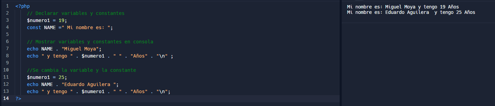</img>

<h2>Punto 2: Sumas de Constantes y Variables</h2>
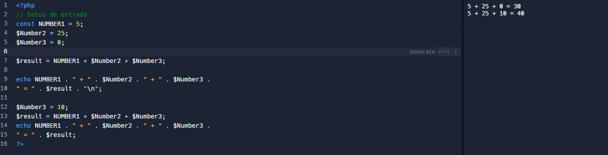

<h2>Punto 3: Sunas de dos numeros indicados por el usuario </h2>
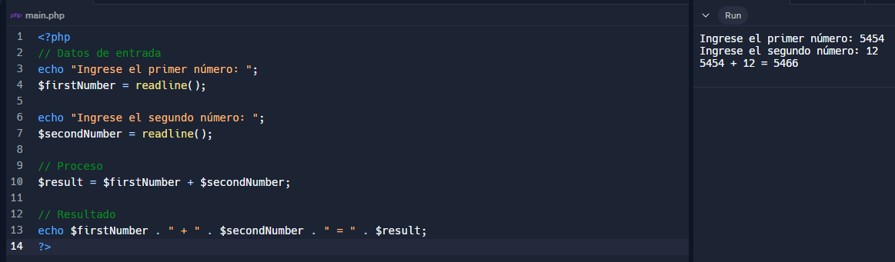

<h2>Punto 4: Datos del Usuario en consola</h2>
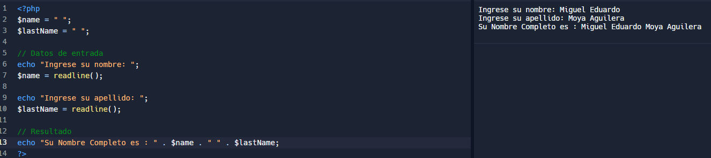

<h2>Punto 5: Entrada de bolera usando if / else </h2>
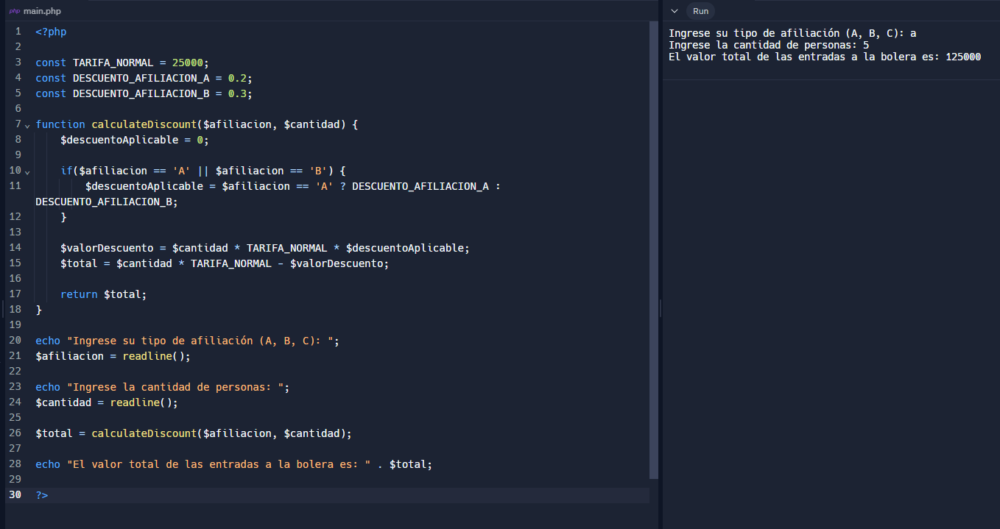

<h2>Punto 6: Deteccion de mayoria de edad </h2>
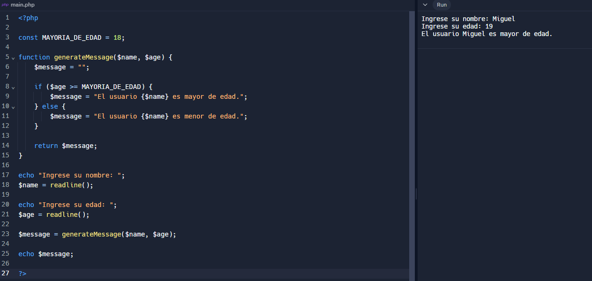

<h2>Punto 7: Seleccion de operacion aritmetica</h2>
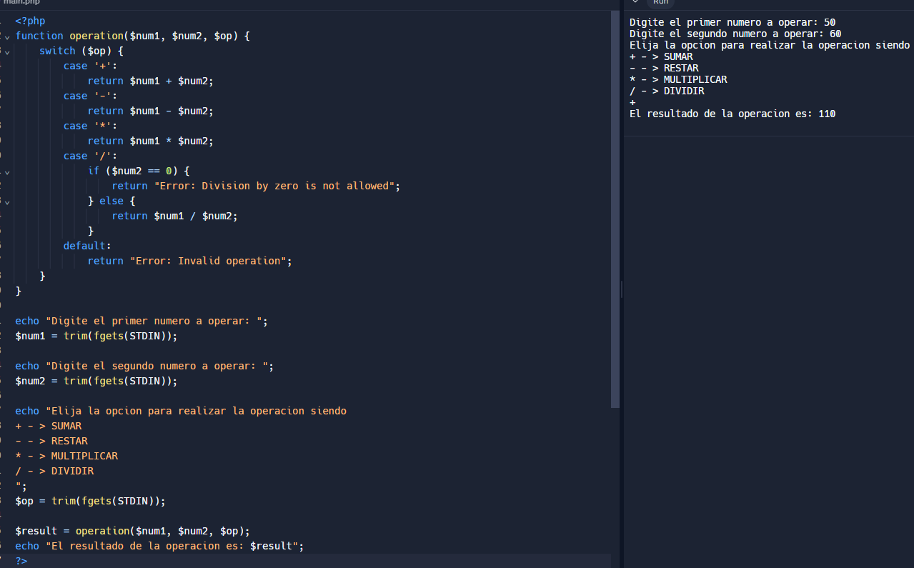

<h2>Punto 8: Entrada de bolera usando Switch</h2>
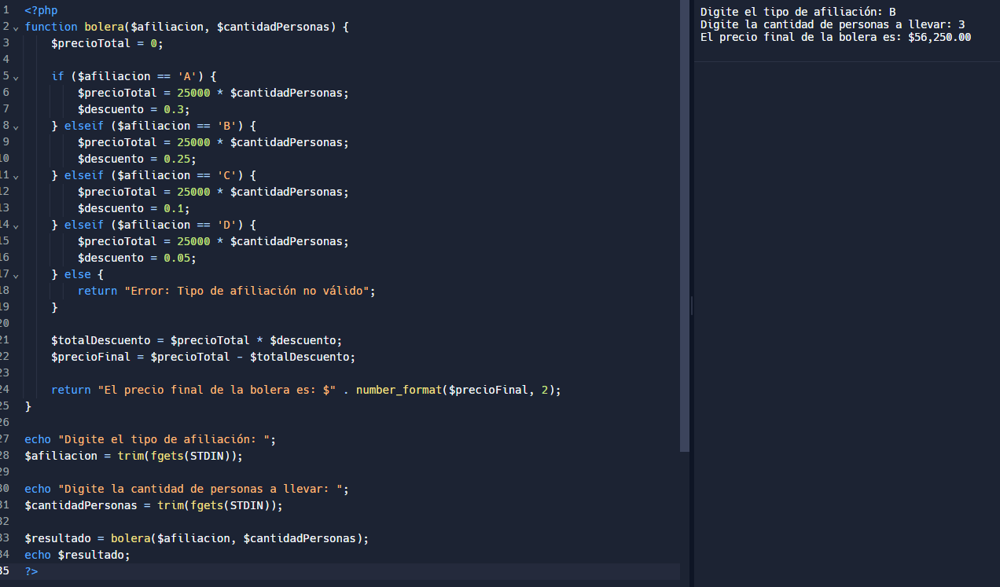

<h2>Punto 9: Tabla de multiplicar usando Switch</h2>
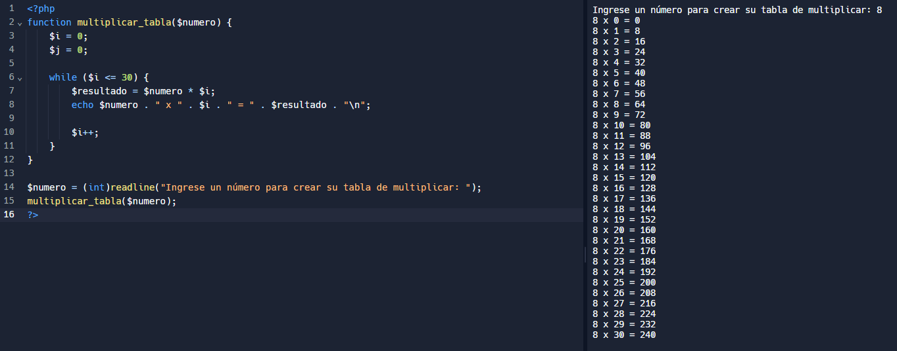

<h2>Punto 10: Numeros pares usando While</h2>
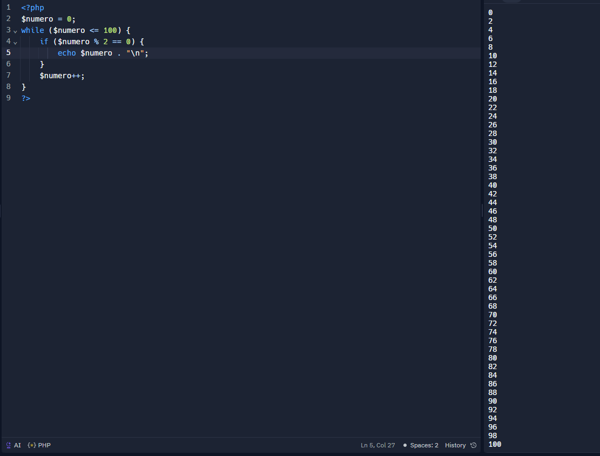

<h2>Punto 11: Numeros impares usando for</h2>
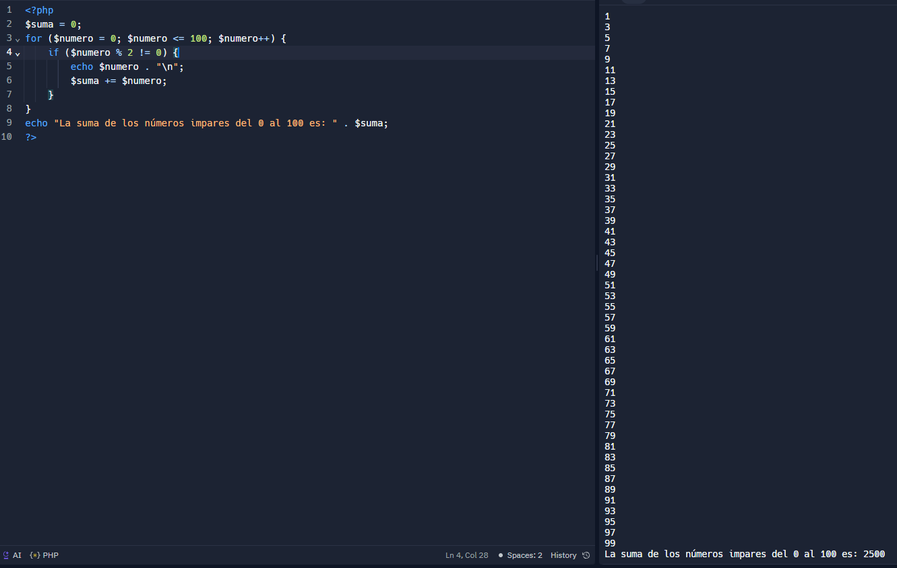

<h2>Punto 12: Tabla de multiplicar usando for</h2>
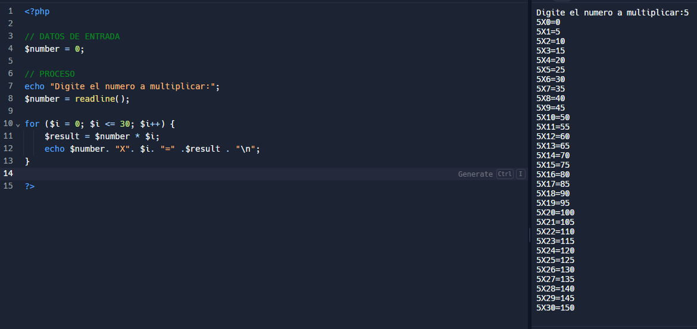

<h2>Punto 13: Sumas de valores de un arreglo usando foreach</h2>
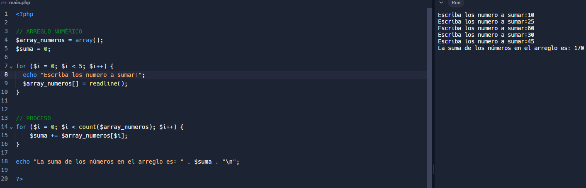

<h2>Punto 14: Revision de contraseña</h2>
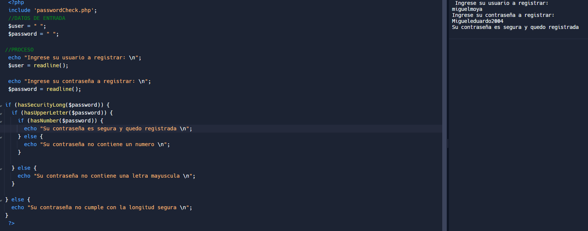

<h2>Punto 15: Seleccion de operacion aritmetica usando funciones</h2>
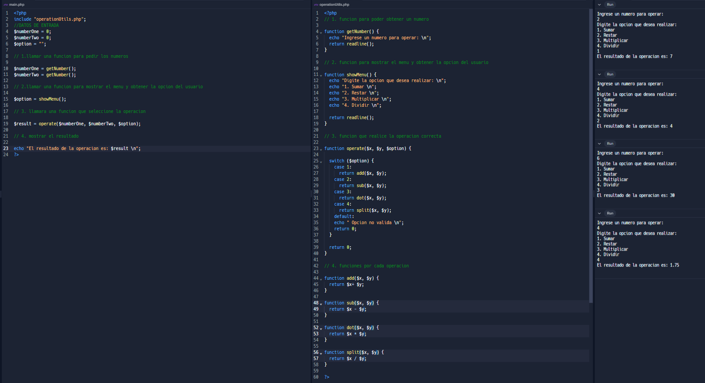